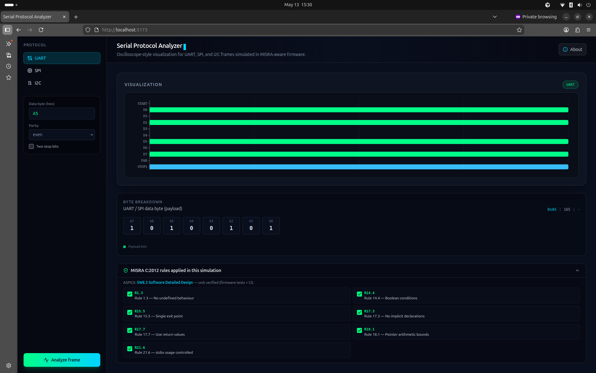
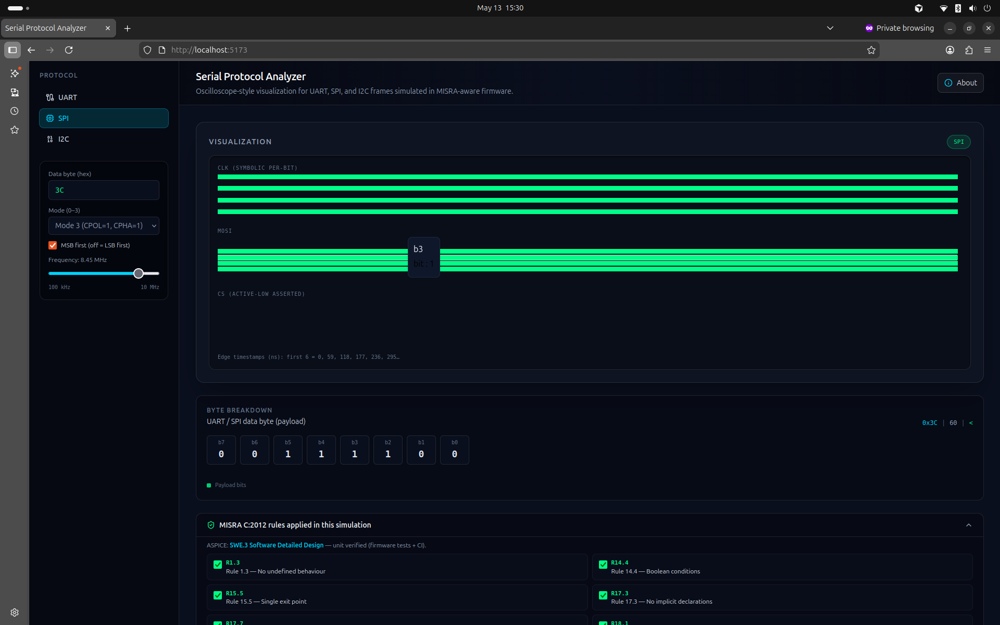
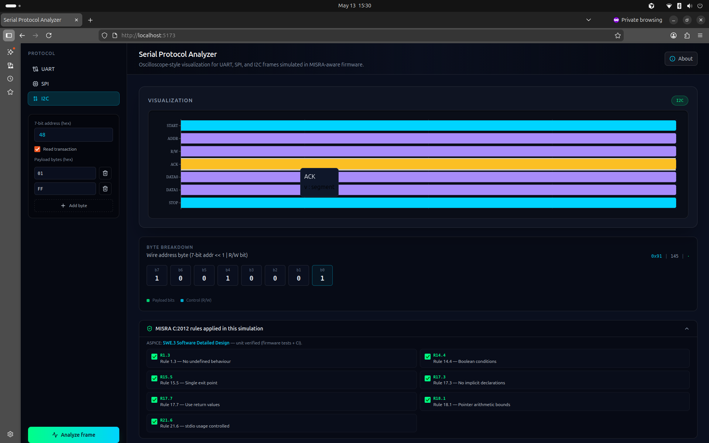
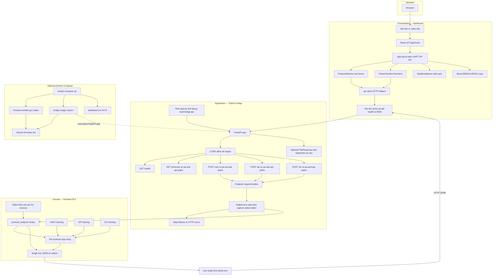

# Embedded Serial Protocol Analyzer

Deterministic **UART**, **SPI**, and **I2C** frame simulation in **C**, a small **FastAPI** bridge, and a **React** dashboard with oscilloscope-style timelines, byte breakdown, and MISRA-oriented notes in the UI.

---

## Screenshots

### UART — start, data, parity, stop



### SPI — clock, MOSI, CS, edge timing



### I2C — START, address, R/W, ACK, data, STOP



---

## Architecture

End-to-end view of how configuration flows from the browser to C simulators and how structured JSON returns for charts and tables.



**Reading the diagram**

- **Presentation**: the dashboard collects per-protocol parameters, calls the shared HTTP client, and renders timelines plus byte grids from the returned JSON.
- **Application**: FastAPI validates requests, maps them to **argv** for the firmware CLI, runs one subprocess per analyze action, and turns firmware output into HTTP JSON or clear error payloads.
- **Domain**: the ELF implements UART, SPI, and I2C framing with explicit timing and bit order; it always prints a **single-line JSON** result for the bridge to parse.
- **Data flow**: each analyze click is one round trip: **JSON in → argv → subprocess → JSON line out → REST JSON in** for the charts.

---

## Tech stack

| Layer | Role | Technologies |
| --- | --- | --- |
| Firmware | Bit-accurate framing and timing | C99, GCC, Make |
| Bridge | REST, validation, process I/O | Python 3, FastAPI, Pydantic, Uvicorn |
| Dashboard | UI, charts, forms | React, TypeScript, Vite, Tailwind, Recharts |

---

## Run locally

**Two processes**: API on **port 8000**, dashboard on **5173** (Vite proxies `/pa`, `/api`, and `/health` to the API).

**1 — API (repository root)**

```bash
bash scripts/run-local-api.sh
```

Or: `python3 -m venv .venv && . .venv/bin/activate && pip install -r requirements.txt && make -C firmware all && python app.py`  
You can also use `python -m uvicorn app:app --reload --host 127.0.0.1 --port 8000` or `python -m uvicorn api:app --reload --host 127.0.0.1 --port 8000` from the **repo root** (both entry modules re-export the same app).

**2 — Dashboard**

```bash
cd dashboard
npm ci
npm run dev
```

Open **http://localhost:5173**. Start the API **before** the dashboard if you rely on the dev proxy.

**Docker (single command from repo root)**

```bash
docker compose up --build
```

Then open **http://localhost:5173** for the UI and **http://localhost:8000** for the API.
